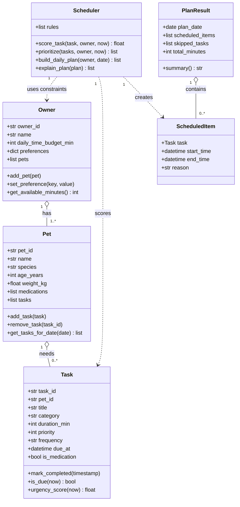

# PawPal+ (Module 2 Project)

You are building **PawPal+**, a Streamlit app that helps a pet owner plan care tasks for their pet.

## Scenario

A busy pet owner needs help staying consistent with pet care. They want an assistant that can:

- Track pet care tasks (walks, feeding, meds, enrichment, grooming, etc.)
- Consider constraints (time available, priority, owner preferences)
- Produce a daily plan and explain why it chose that plan

Your job is to design the system first (UML), then implement the logic in Python, then connect it to the Streamlit UI.

## What you will build

Your final app should:

- Let a user enter basic owner + pet info
- Let a user add/edit tasks (duration + priority at minimum)
- Generate a daily schedule/plan based on constraints and priorities
- Display the plan clearly (and ideally explain the reasoning)
- Include tests for the most important scheduling behaviors

## Getting started

### Setup

```bash
python -m venv .venv
source .venv/bin/activate  # Windows: .venv\Scripts\activate
pip install -r requirements.txt
```

### Suggested workflow

1. Read the scenario carefully and identify requirements and edge cases.
2. Draft a UML diagram (classes, attributes, methods, relationships).
3. Convert UML into Python class stubs (no logic yet).
4. Implement scheduling logic in small increments.
5. Add tests to verify key behaviors.
6. Connect your logic to the Streamlit UI in `app.py`.
7. Refine UML so it matches what you actually built.

## OOP Architecture Draft (PawPal+)

Use this as your design baseline before writing full logic.

### Core objects

1. Owner
- Attributes: owner_id, name, daily_time_budget_min, preferences, pets
- Methods: add_pet(), set_preference(), get_available_minutes()

2. Pet
- Attributes: pet_id, name, species, age_years, weight_kg, medications, tasks
- Methods: add_task(), remove_task(), get_tasks_for_date()

3. Task
- Attributes: task_id, pet_id, title, category, duration_min, priority, frequency, due_at, is_medication, completed_at
- Methods: mark_completed(), is_due(now), urgency_score(now)

4. Scheduler
- Attributes: rules
- Methods: score_task(task, owner, now), prioritize(tasks, owner, now), build_daily_plan(owner, date), explain_plan(plan)

5. ScheduledItem
- Attributes: task, start_time, end_time, reason
- Methods: overlaps_with(other), to_dict()

6. PlanResult
- Attributes: plan_date, scheduled_items, skipped_tasks, total_minutes
- Methods: summary(), to_dict()

### Mermaid class diagram



## Smarter Scheduling

This project extends the core `Scheduler` class with four algorithmic features beyond
the basic daily plan builder.

### Sorting by time — `Scheduler.sort_by_time(tasks)`

Returns a new list of `Task` objects ordered by `due_at` time (earliest first).
Uses a **lambda key** on Python's `sorted()` that extracts each task's time as a
`"HH:MM"` string, with a `"99:99"` sentinel so tasks without a pinned time fall to
the end. This keeps the original list intact and makes the sorted view cheap to produce.

### Filtering by status or pet — `Scheduler.filter_tasks(tasks, *, completed, pet_name, pets)`

Filters a flat task list by any combination of:
- **completion status** (`completed=True` → done, `completed=False` → pending)
- **pet name** (`pet_name="Mochi"` → only Mochi's tasks, resolved via `pets` list)

All keyword arguments are optional; omitting one means "no filter on that dimension".

### Auto-recurrence on completion — `Scheduler.mark_task_complete(task, pet)`

When a **daily** or **weekly** task is marked complete, a new instance is automatically
created for the next occurrence using Python's `timedelta`:

- `"daily"` → `due_at = completed_date + timedelta(days=1)`
- `"weekly"` → `due_at = same weekday next week` (via `timedelta(days=7)`)
- `"as_needed"` → no new task; returns `None`

The new task is cloned from the original (`dataclasses.replace`) with a fresh `task_id`
and `completed_at` reset, then appended to the pet's task list so future plans pick it up
automatically.

### Conflict detection with warnings — `Scheduler.warn_task_conflicts(tasks, pets)`

Checks every unique pair of timed tasks (those with a `due_at`) for overlapping windows
using the standard half-open interval condition:

```
A.start < B.end  and  B.start < A.end
```

Returns a **list of warning strings** — one per conflict — instead of raising an
exception. Works for same-pet and cross-pet conflicts. Tasks without a `due_at` are
excluded because they have no pinned clock position.

---

### Relationship review

- Owner to Pet is one-to-many, which matches the domain.
- Pet to Task is one-to-many, keeping task ownership clear.
- Scheduler depends on owner constraints and task data, but does not own pets or tasks.
- PlanResult contains generated ScheduledItem objects, separating planning output from raw task input.
- Complexity is intentionally limited: no inheritance hierarchy yet, and no persistence layer objects yet.
