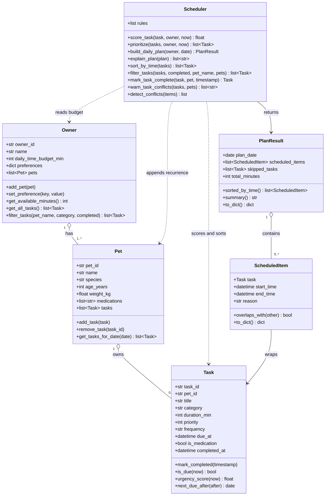

# PawPal+ (Module 2 Project)

A smart pet care scheduling app built with Python and Streamlit. PawPal+ helps busy pet owners stay consistent with pet care by generating a prioritised daily plan, detecting scheduling conflicts, and automatically re-queuing recurring tasks.

---

## 📸 Demo

<a href="/course_images/ai110/image.png" target="_blank"></a>


---

## ✨ Features

### Core scheduling

- **Daily plan builder** — `Scheduler.build_daily_plan()` selects tasks that are due today, scores them by urgency, and fits them into the owner's time budget. Tasks that don't fit are listed as skipped so nothing is silently dropped.

- **Urgency scoring** — `Task.urgency_score()` combines task priority (1–5), a medication bonus (+30), and an overdue penalty (up to +20 based on hours past due) into a single float. The scheduler sorts descending on this score so the most critical tasks are always placed first.

- **Medication-first guarantee** — medication tasks receive a large urgency bonus, ensuring they are scheduled before any lower-priority walks or enrichment activities regardless of the order they were added.

### Smart algorithms

- **Sorting by time** — `Scheduler.sort_by_time()` returns a new list of tasks ordered by `due_at` (earliest first). Tasks without a pinned time fall to the end via a `"99:99"` sentinel. The original list is never mutated.

- **Conflict detection** — `Scheduler.warn_task_conflicts()` checks every unique pair of timed tasks for overlapping windows using the half-open interval condition (`A.start < B.end and B.start < A.end`). It returns plain-English warning strings — one per conflict — which the UI surfaces as yellow banners before the schedule is generated.

- **Auto-recurrence on completion** — `Scheduler.mark_task_complete()` marks a task done and automatically creates the next occurrence:
  - `"daily"` → due tomorrow (same time of day)
  - `"weekly"` → due same weekday next week
  - `"as_needed"` → no new task created

- **Filtering** — `Scheduler.filter_tasks()` accepts any combination of completion status (`completed=True/False`) and pet name, returning only the tasks that match all supplied criteria.

### UI

- Conflict warnings appear as `st.warning` banners in both the task list and the schedule section, naming the specific tasks and their overlapping time windows.
- The task table is sorted chronologically and can be filtered to show pending tasks only.
- An expandable "Why this order?" section explains the scheduling reasoning for each item in plain English.

---

## Scenario

A busy pet owner needs help staying consistent with pet care. They want an assistant that can:

- Track pet care tasks (walks, feeding, meds, enrichment, grooming, etc.)
- Consider constraints (time available, priority, owner preferences)
- Produce a daily plan and explain why it chose that plan

Your job is to design the system first (UML), then implement the logic in Python, then connect it to the Streamlit UI.

## What you will build

Your final app should:

- Let a user enter basic owner + pet info
- Let a user add/edit tasks (duration + priority at minimum)
- Generate a daily schedule/plan based on constraints and priorities
- Display the plan clearly (and ideally explain the reasoning)
- Include tests for the most important scheduling behaviors

## Getting started

### Setup

```bash
python -m venv .venv
source .venv/bin/activate  # Windows: .venv\Scripts\activate
pip install -r requirements.txt
```

### Suggested workflow

1. Read the scenario carefully and identify requirements and edge cases.
2. Draft a UML diagram (classes, attributes, methods, relationships).
3. Convert UML into Python class stubs (no logic yet).
4. Implement scheduling logic in small increments.
5. Add tests to verify key behaviors.
6. Connect your logic to the Streamlit UI in `app.py`.
7. Refine UML so it matches what you actually built.

## OOP Architecture Draft (PawPal+)

Use this as your design baseline before writing full logic.

### Core objects

1. Owner
- Attributes: owner_id, name, daily_time_budget_min, preferences, pets
- Methods: add_pet(), set_preference(), get_available_minutes()

2. Pet
- Attributes: pet_id, name, species, age_years, weight_kg, medications, tasks
- Methods: add_task(), remove_task(), get_tasks_for_date()

3. Task
- Attributes: task_id, pet_id, title, category, duration_min, priority, frequency, due_at, is_medication, completed_at
- Methods: mark_completed(), is_due(now), urgency_score(now)

4. Scheduler
- Attributes: rules
- Methods: score_task(task, owner, now), prioritize(tasks, owner, now), build_daily_plan(owner, date), explain_plan(plan)

5. ScheduledItem
- Attributes: task, start_time, end_time, reason
- Methods: overlaps_with(other), to_dict()

6. PlanResult
- Attributes: plan_date, scheduled_items, skipped_tasks, total_minutes
- Methods: summary(), to_dict()

### Mermaid class diagram (final — matches pawpal_system.py)



## Smarter Scheduling

This project extends the core `Scheduler` class with four algorithmic features beyond
the basic daily plan builder.

### Sorting by time — `Scheduler.sort_by_time(tasks)`

Returns a new list of `Task` objects ordered by `due_at` time (earliest first).
Uses a **lambda key** on Python's `sorted()` that extracts each task's time as a
`"HH:MM"` string, with a `"99:99"` sentinel so tasks without a pinned time fall to
the end. This keeps the original list intact and makes the sorted view cheap to produce.

### Filtering by status or pet — `Scheduler.filter_tasks(tasks, *, completed, pet_name, pets)`

Filters a flat task list by any combination of:
- **completion status** (`completed=True` → done, `completed=False` → pending)
- **pet name** (`pet_name="Mochi"` → only Mochi's tasks, resolved via `pets` list)

All keyword arguments are optional; omitting one means "no filter on that dimension".

### Auto-recurrence on completion — `Scheduler.mark_task_complete(task, pet)`

When a **daily** or **weekly** task is marked complete, a new instance is automatically
created for the next occurrence using Python's `timedelta`:

- `"daily"` → `due_at = completed_date + timedelta(days=1)`
- `"weekly"` → `due_at = same weekday next week` (via `timedelta(days=7)`)
- `"as_needed"` → no new task; returns `None`

The new task is cloned from the original (`dataclasses.replace`) with a fresh `task_id`
and `completed_at` reset, then appended to the pet's task list so future plans pick it up
automatically.

### Conflict detection with warnings — `Scheduler.warn_task_conflicts(tasks, pets)`

Checks every unique pair of timed tasks (those with a `due_at`) for overlapping windows
using the standard half-open interval condition:

```
A.start < B.end  and  B.start < A.end
```

Returns a **list of warning strings** — one per conflict — instead of raising an
exception. Works for same-pet and cross-pet conflicts. Tasks without a `due_at` are
excluded because they have no pinned clock position.

---

## Testing PawPal+

### Run the tests

```bash
python -m pytest -v
```

### What the tests cover

The suite contains **34 tests** across seven areas:

| Area | Tests | What's verified |
|---|---|---|
| Task completion | 3 | `mark_completed()` stamps a timestamp; a completed task is no longer due |
| Pet task management | 5 | Adding/removing tasks; `pet_id` is stamped automatically |
| **Sorting correctness** | 4 | `sort_by_time()` returns tasks in chronological order; untimed tasks go last; original list is not mutated |
| Filtering | 5 | Filter by completion status and pet name; unknown pet returns empty list |
| **Recurrence logic** | 6 | Completing a daily task creates a new task due the next day; weekly creates one 7 days later; `as_needed` creates nothing; time-of-day is preserved; original task is stamped done |
| **Conflict detection** | 6 | Overlapping windows produce a warning; adjacent tasks do not; exact duplicate start times are flagged; untimed tasks are ignored; cross-pet conflicts are caught |
| Daily plan builder | 5 | Budget is respected; medications scheduled first; empty inputs return valid empty plans; `total_minutes` matches scheduled durations |

### Confidence Level

**★★★★★ (5/5)**

All 34 tests pass in under 0.1 s. The suite covers the three core algorithmic behaviors (sorting, recurrence, conflict detection) across normal cases, edge cases (empty inputs, adjacent tasks, cross-pet conflicts, duplicate start times), and boundary conditions (budget limits, `as_needed` frequency). Each class method has targeted tests that isolate its behavior, giving high confidence in the scheduler's reliability.

---

### Relationship review

- Owner to Pet is one-to-many, which matches the domain.
- Pet to Task is one-to-many, keeping task ownership clear.
- Scheduler depends on owner constraints and task data, but does not own pets or tasks.
- PlanResult contains generated ScheduledItem objects, separating planning output from raw task input.
- Complexity is intentionally limited: no inheritance hierarchy yet, and no persistence layer objects yet.
